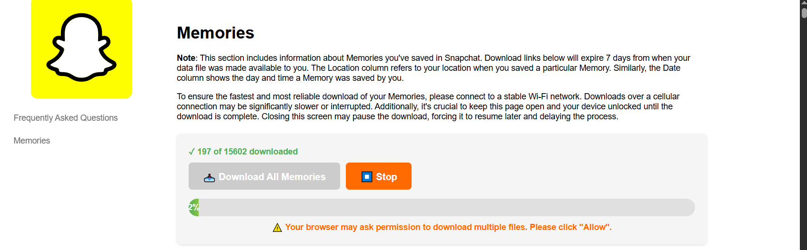

# Snapchat Memory Bulk Downloader

## Why This Script Exists

Snapchat is going to start charging for memories. A lot of people used Snapchat as free cloud storage for their photos and videos, so they probably have thousands of files stored there.

Snapchat lets you export your data, but you have to download each file manually one by one from an HTML page. If you have hundreds or thousands of memories, that's going to take forever. This script does it automatically for you.

## How Snapchat Data Export Works

### Step 1: Request Your Data Export

1. Go to [https://accounts.snapchat.com/v2/download-my-data](https://accounts.snapchat.com/v2/download-my-data)
   - Or on mobile: Click on your Bitmoji → Settings Icon → My Data

2. Select "Export your Memories" and choose "Request Only Memories"


3. Select your desired date range for the memories you want to export


### Step 2: Download Your Data

After a few hours, Snapchat will send you an email notification that your data is ready for download.


### Step 3: The Manual Download Problem

Once you download and extract your data, you'll get a `mydata` folder containing:
- An HTML file
- A `html` folder with `memories_history.html`

When you open `memories_history.html`, you'll see all your memories listed in a table format. Even though there's a "Download All Memories" button, you still have to manually confirm the save location for each individual file - which means clicking "Save" thousands of times if you have a lot of memories:




## What This Script Does

This script automatically downloads all your memories from the HTML file and splits them into separate `images` and `videos` folders.

## Requirements

- Python 3.6 or higher
- Required Python packages:
  ```bash
  pip install requests beautifulsoup4
  ```

**Don't have Python?** Check the [Releases](https://github.com/anditv21/snapchat-memory-export/releases/tag/Release) section for a pre-built executable file that you can run directly without installing Python.

## How to Use

1. **Export your Snapchat data** following the steps above
2. **Extract the downloaded data** and locate the `html/memories_history.html` file
3. **Place this script** in the same directory as your extracted Snapchat data (where you can see the `html` folder)
4. **Run the script**:
   ```bash
   python snapchat_memory.py
   ```


## Configuration

You can modify these settings at the top of the script:

- `HTML_FILE`: Path to your memories HTML file (default: `"html/memories_history.html"`)
- `DOWNLOAD_FOLDER`: Where to save downloaded files (default: `"downloads"`)
- `DELAY`: Seconds to wait between downloads (default: `2`)

## Important Notes

- The script includes delays between downloads to be respectful to Snapchat's servers
- Photos are saved as `.jpg` and videos as `.mp4`
- If some downloads fail, you can re-run the script and it will skip files that already downloaded successfully

---

*Created because nobody should have to manually download thousands of memories one by one when Snapchat starts charging for access to your own data.*
